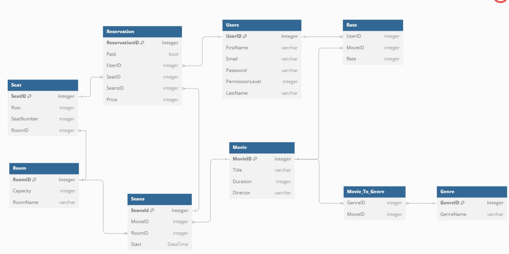
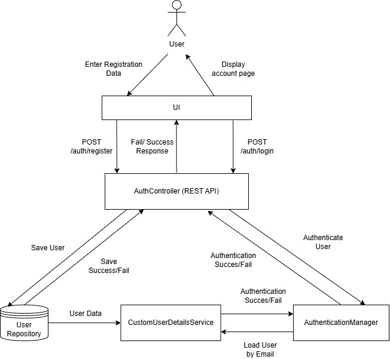

# jk-sr-0800-droptable

## Opis projektu

### Problem

Zarządzanie multipleksem kinowym może być skomplikowane z powodu wielu sal, licznych seansów oraz potrzeby zarządzania dużą liczbą użytkowników.
System wymaga efektywnego sposobu rejestrowania i uwierzytelniania użytkowników, zarządzania ich danymi, a także integracji z przyszłymi funkcjami,
takimi jak rezerwacje miejsc czy obsługa repertuaru.

### Rozwiązanie

Aby rozwiązać te problemy, stworzyliśmy nowoczesną aplikację REST API, która jest oparta na:

- **Spring Boot**: Zapewnia wydajność, rozszerzalność i łatwość integracji.
- **Hibernate**: Ułatwia zarządzanie bazą danych przy użyciu ORM.
- **Spring Security**: Dba o bezpieczeństwo danych użytkowników, szczególnie haseł.

Dzięki zastosowaniu REST API aplikacja umożliwia:

- Rejestrację i logowanie użytkowników, w tym bezpieczne szyfrowanie haseł.
- Zarządzanie użytkownikami w przyjazny i bezpieczny sposób.
- Modularność systemu, ułatwiającą wprowadzanie nowych funkcji, takich jak:
  - Rezerwacje miejsc.
  - Planowanie repertuaru.
  - Raportowanie frekwencji czy sprzedaży biletów.

Projekt został zaprojektowany z myślą o skalowalności i łatwej możliwości integracji z bardziej zaawansowanymi funkcjami w przyszłości.

## Model Bazodanowy



## Kontrolery

### `AuthController`

`AuthController` zajmuje się obsługą rejestracji i logowaniem użytkowników w systemie Multiplex. Oferuje dwa główne punkty końcowe: rejestrację oraz logowanie.

#### **Rejestracja użytkownika**

**Endpoint:**  
`POST /auth/register`

**Opis:**  
Rejestruje nowego użytkownika w systemie.

**Treść żądania (`Request Body`):**

| Nazwa pola  | Typ    | Walidacja                                      | Opis                      |
| ----------- | ------ | ---------------------------------------------- | ------------------------- |
| `firstName` | String | Nie puste                                      | Imię użytkownika.         |
| `lastName`  | String | Nie puste                                      | Nazwisko użytkownika.     |
| `email`     | String | Unikalny email w poprawnym formacie, Nie pusty | Adres e-mail użytkownika. |
| `password`  | String | Nie puste                                      | Hasło do konta.           |

**Odpowiedź:**

- **Status 200 OK:** Rejestracja zakończona sukcesem.  
  Przykład odpowiedzi:

  ```json
  {
    "message": "Registration successful!"
  }
  ```

- **Status 400 Bad Request:** Podany adres e-mail jest już używany.  
  Przykład odpowiedzi:
  ```json
  {
    "error": "User with this email already exists."
  }
  ```

---

#### **Logowanie użytkownika**

**Endpoint:**  
`POST /auth/login`

**Opis:**  
Autoryzuje istniejącego użytkownika i pozwala mu się zalogować do systemu.

**Treść żądania (`Request Body`):**

| Nazwa pola | Typ    | Walidacja                                   | Opis                      |
| ---------- | ------ | ------------------------------------------- | ------------------------- |
| `email`    | String | Email przynależny do użytkownika, Nie puste | Adres e-mail użytkownika. |
| `password` | String | Nie puste                                   | Hasło do konta.           |

**Odpowiedź:**

- **Status 200 OK:** Logowanie zakończone sukcesem.  
  Przykład odpowiedzi:

  ```json
  {
    "message": "Login successful!"
  }
  ```

- **Status 401 Unauthorized:** Logowanie nie powiodło się z powodu niepoprawnych danych logowania (np. błędny e-mail lub błędne hasło).  
  Przykład odpowiedzi:
  ```json
  {
    "error": "Invalid credentials."
  }
  ```

### `UserController`

`UserController` zajmuje się zarządzaniem danymi użytkowników w systemie Multiplex. Dostarcza punktów końcowych umożliwiających aktualizację danych użytkownika oraz usunięcie użytkownika na podstawie adresu e-mail.

---

#### **Aktualizacja użytkownika**

**Endpoint:**  
`PUT /user`

**Opis:**  
Aktualizuje dane istniejącego użytkownika lub dodaje nowego użytkownika do systemu, jeśli użytkownik nie istnieje.

**Treść żądania (`Request Body`):**

| Nazwa pola  | Typ    | Walidacja                                      | Opis                      |
| ----------- | ------ | ---------------------------------------------- | ------------------------- |
| `firstName` | String | Nie puste                                      | Imię użytkownika.         |
| `lastName`  | String | Nie puste                                      | Nazwisko użytkownika.     |
| `email`     | String | Unikalny email w poprawnym formacie, Nie pusty | Adres e-mail użytkownika. |
| `password`  | String | Nie puste                                      | Hasło użytkownika.        |

**Odpowiedź:**

- **Status 200 OK:** Zaktualizowano dane użytkownika lub dodano nowego użytkownika.  
  Przykład odpowiedzi:
  ```json
  {
    "firstName": "Adam",
    "lastName": "Nowak",
    "email": "adam.nowak@example.com",
    "password": "encodedPasswordHere"
  }
  ```

---

#### **Usunięcie użytkownika**

**Endpoint:**  
`DELETE /user/{id}`

**Opis:**  
Usuwa istniejącego użytkownika z systemu na podstawie id.
**Odpowiedź:**

- **Status 200 OK:** Użytkownik został usunięty z systemu.

- **Status 404 Not Found:** Użytkownik o podanym adresie e-mail nie istnieje w systemie.  
  Przykład odpowiedzi:
  ```json
  {
    "error": "User with email adam.nowak@example.com not found."
  }
  ```

## Diagram Przepływu Logowania i Rejestracji

W celu lepszego zrozumienia, jak działa proces rejestracji i autoryzacji użytkowników w systemie, przedstawiamy diagram przepływu tego procesu. Diagram ilustruje kroki, które zachodzą od momentu wprowadzenia danych przez użytkownika, aż po ich zapis w bazie danych lub uwierzytelnienie użytkownika w systemie.

---



### **Opis przebiegu rejestracji użytkownika**

1. **Użytkownik wprowadza dane:**  
   Użytkownik wypełnia formularz rejestracji, podając swoje dane, takie jak imię, nazwisko, e-mail i hasło.

2. **Przesłanie żądania:**  
   Dane są przesyłane za pomocą żądania `POST /auth/register` do kontrolera `AuthController`.

3. **Walidacja danych:**  
   `AuthController` sprawdza poprawność wprowadzonych danych. Weryfikuje, czy:
   - Wszystkie pola są poprawnie wypełnione.
   - Podany e-mail nie istnieje już w systemie.

4. **Szyfrowanie hasła:**  
   Jeśli dane są poprawne, hasło użytkownika jest szyfrowane przy użyciu `PasswordEncoder`, który jest dostarczany przez Spring Security. Szyfrowanie hasła zapewnia, że nawet jeśli dane zostaną przechwycone lub baza danych zostanie naruszona, hasła użytkowników pozostaną bezpieczne.

5. **Zapis w bazie danych:**  
   Tworzony jest nowy obiekt użytkownika, który następnie zostaje zapisany w bazie danych przy użyciu `UserRepository`.

6. **Odpowiedź do użytkownika:**  
   Po pomyślnym zapisaniu danych serwer zwraca odpowiedź potwierdzającą rejestrację. W przypadku błędu (np. istniejącego e-maila), użytkownik otrzymuje odpowiednią wiadomość zwrotną.

---

### **Opis przebiegu logowania użytkownika**

1. **Użytkownik wprowadza dane:**  
   Użytkownik wypełnia formularz logowania, podając swoje dane uwierzytelniające, takie jak e-mail i hasło.

2. **Przesłanie żądania:**  
   Dane są przesyłane za pomocą żądania `POST /auth/login` do kontrolera `AuthController`.

3. **Walidacja danych:**  
   `AuthController` przekazuje dane do `AuthenticationManager`, który jest konfigurowany w ramach Spring Security. `AuthenticationManager`:
   - Korzysta z `CustomUserDetailsService` do ładowania szczegółów użytkownika z bazy danych.
   - Sprawdza, czy użytkownik z podanym e-mailem istnieje.
   - Porównuje zaszyfrowane hasło wprowadzone przez użytkownika z hasłem przechowywanym w bazie danych przy użyciu mechanizmu Spring Security.

4. **Uwierzytelnienie:**  
   Jeśli dane logowania są poprawne, użytkownik zostaje uwierzytelniony i Spring Security tworzy dla niego sesję.

5. **Odpowiedź do użytkownika:** 
   Po pomyślnym uwierzytelnieniu serwer zwraca odpowiedź potwierdzającą logowanie. W przypadku błędu (np. błędne hasło lub e-mail), użytkownik otrzymuje komunikat zwrotny.

---

### **Rola Spring Security w procesach rejestracji i logowania**
- **Szyfrowanie haseł:** Dzięki `PasswordEncoder` hasła są przechowywane w bezpieczny sposób.
- **Walidacja danych uwierzytelniających:** `AuthenticationManager` i `CustomUserDetailsService` umożliwiają weryfikację użytkowników i ich haseł.
- **Ochrona punktów końcowych:** Spring Security zapewnia kontrolę dostępu do endpointów, umożliwiając dostęp do wybranych zasobów tylko po zalogowaniu.
- **Bezpieczeństwo aplikacji:** Oferuje gotowe mechanizmy ochrony przed popularnymi atakami, takimi jak CSRF czy brute force.

---